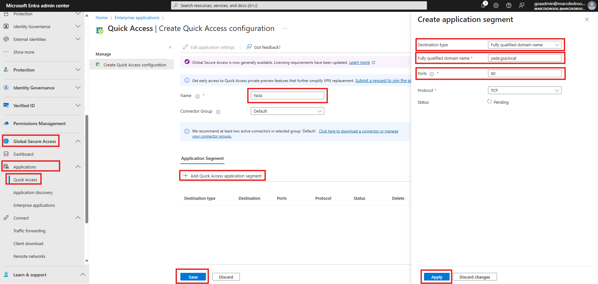

# Global Secure Access lab
Microsoft's Security Service Edge (SSE) solution is comprised of Entra Private Access and Entra Internet Access, unified under the name [Global Secure Access](https://learn.microsoft.com/en-us/entra/global-secure-access/overview-what-is-global-secure-access). 

GSA is part of the Microsoft Entra ID portfolio and is operated from the [Entra portal](https://entra.microsoft.com/#home). 

## Scenario
This lab explores both the Private- and Internet Access components of GSA. 
### Private access
A backend application, based on Jose Moreno's [Yet Another Demo App (YADA)](https://github.com/Microsoft/YADA), is deployed on VMs in a VNET and exposed through an Internal Load Balancer.
We want the application to be available to all users registered in our Entra ID tenant, without the need for a network connection from user's devices to the VNET. The application is accessible via an internal FQDN that resolves to the internal IP address of the ILB. 

We also want to provide SSH console access to the application's VMs to only our global secure access administrator user, again without a network connection between the user's device and the VNET.
### Internet access
The lab then continues to explore Entra Internet Access, demonstrating how to control and secure internet access from user devices, again without a connection to the corporate network.

## Prerequisites
Most important prequisite is to have a user with *both* [Global Secure Access Administrator](https://learn.microsoft.com/en-us/entra/global-secure-access/quickstart-access-admin-center) *and* [Application Administrator](https://learn.microsoft.com/en-us/entra/global-secure-access/troubleshoot-connectors#verify-admin-is-used-to-install-the-connector) access, or Global Administrator access, to an Entra ID P1 or P2 tenant. GSA is not available under Entra ID Free tenants.

Client device(s) must run 64-bit versions of Windows 11 or Windows 10. The client must be either Microsoft Entra joined or Microsoft Entra hybrid joined to the same tenant that GSA is configured on. As this will usually not be the corporate tenant that your laptop is joined to, the most pragmatic way forward is to [run Windows 11 on a nested virtual machine](https://techcommunity.microsoft.com/t5/itops-talk-blog/how-to-run-a-windows-11-vm-on-hyper-v/ba-p/3713948).

An Azure subscription is required to deploy the backend application. This subscription does not have under the same tenant that GSA is configured on.

## Backend application
The lab backend deployed to Azure comprises following components:

- One Virtual Network.
- Two VMs running the YADA web tier, behind both and an Internal and an External Load Balancer.
- One VM running the YADA application tier.
- One VM running Windows Server, this will be used to install the GSA Connector.
- A Pivate DNS Zone linked to the VNET, with A (IpV4) and AAAA (IPv6) records for the ILB frontend and each of the VMs.

### Deploy
Log in to Azure Cloud Shell at https://shell.azure.com/ and select Bash.

Ensure Azure CLI and extensions are up to date:
  
    az upgrade --yes
  
If necessary select your target subscription:
  
    az account set --subscription <Name or ID of subscription>

Clone the  GitHub repository: 

    git clone https://github.com/mddazure/entra-gsa-lab

Change directory:
  
    cd ./entra-gsa-lab

Create Resource Group:

    az group create -l <region> -n <rgname>

Accept terms of use of the Kinvolk Flatcar image:

    az vm image terms accept -p kinvolk -f flatcar-container-linux-free --plan stable-gen2 -o none

Deploy template:

    az deployment group create -g <rgname> --template-file main.bicep --parameters location=<region>

### Verify
The YADA web tier should now be available through the ELB's public endpoints. Obtain both the IPv4 and IPv6 frontend addresses:

    az network public-ip list -g gsa-lab -o table

(Ignore bastionipv4 in the output from above command).

Access the Windows 11 client you intend to use in this lab, and browse to both the IPv4 and IPv6 endpoints (enclose the IPv6 address in square brackets [] when pasting in to the browser's address line).

## Global Secure Access

### Install Private Network Connector
The first step in setting up GSA is to install the Entra Private Network Connector agent on the gsaconnector VM. This VM runs Windows Server 2022 and it does not have to be joined to Entra ID. The role of the connector is to establish an outbound connection to the Microsoft Entra Private Access and application proxy services. This connection then serves as a bidrectional connection path between the application proxy and the applications inside a private network, without needing inbound connectivity from the internet into the private network. This communication path is shown in the above diagram as the green dashed lines.

Log on to the VM named gsaconnector via Bastion.
Username: AzureAdmin
Password: GSA-demo2024 

In Server Manager, set IE Enhanced Security Configuration to Off:

Browse to 

    https://entra.microsoft.com

and log on with the credentials of a user with the Global Secure Access Administrator and Application Administrator roles in your Entra ID tenant.

In the left-hand pane, scroll down to Global Secure Access and click the carret to open the menu. Scroll further down, click the carret next to Connect to open the submenu and click Connectors. Then click Download connector service at the top of the screen, and Accept terms & Download in the right-hand window.

Open the installer when it has downloaded. Sign in with the credentials of your Entra ID user with the Global Secure Access Administrator and Application Administrator roles.

When the Connector has successfully installed, it will connect to Entra and be listed in the Private Network connectors page:

You can now disconnect from the gsaconnector VM.

### Install Client 
Next is the installation of the [Global Secure Access client](https://learn.microsoft.com/en-us/entra/global-secure-access/how-to-install-windows-client). The client machine must run a 64-bit version of Windows 10 or 11 and must be joined to Entra ID. 

:point_right: When using a nested VM on a corporate laptop, be aware that Virtual machines where both the host and guest Operating Systems have the Global Secure Access client installed [are not supported](https://learn.microsoft.com/en-us/entra/global-secure-access/how-to-install-windows-client#known-limitations).

:point_right: When logging in to a nested VM in Hyper-V, you may see a message saying you need teh right to sign in via Remote Desktop Services. When this happens, change to Basic session in the Remote Desktop client by clicking the screen icon at the top

On the client machine, sign in to the [Entra admin center](https://entra.microsoft.com/) as an Entra user that has the Global Secure Access Administrator role. 

Browse to Global Secure Access > Connect > Client download.

Select Client download.

Run GlobalSecureAccessClient.exe and accept the terms.

Sign is as an Entra ID user when asked.

The Client will connect to Entra and the icon in the taskbar will show a green tick mark. 
Left clicking the icon shows clients status, right clicking the icon shows menu options.

### Configure GSA

#### Private Access
##### Web access to Yada
We will first configure a Private Access policy to allow all users in Entra ID tenant to access to web applicatiion. This is achieved easiest through [Quick Access](https://learn.microsoft.com/en-us/entra/global-secure-access/how-to-configure-quick-access), which configures application access that applies to all users in the Entra tenant.

The web application is behind an Internal Load Balancer, and the ILB front-end address has A (IPv4) and AAAA (IPv6) records named `yada` in the Private DNS Zone `gsa.local`.

Log in to the [Entra admin center ](https://entra.microsoft.com/) as a user with both the Global Secure Access Administrator and Application Administrator roles.

In the left pane, scroll down to Global Secure Access, then click Applications and Quick Access. Name the application Yada, leave Connector Group as Default and click +Add Quick Access application segment.

In the panel appearing on the right, select Destination type as Fully qualified domain name. Then enter `yada.gsa.local` as the FQDN, enter 80 for Ports, leave Protocol as TCP and click Apply. In the main screen click Save.

:question: Quick Access applications should be accessible to all usersin the tenant without further configuration. However, testing at the time of this writing in August 2024 shows that users must still be specifically added to the Enterprise application created by  the Quick Access configuration.

Navigate to the Enterprise appliction, click Users and groups and add individual users.

Log on to your client device as one of your normal users and browse to `yada.gsa.local`.

You should now see the Yada application home page. Scroll down to Your IP address. Note that the application sees the request sourced from the gsaconnector vm at 10.0.1.4.

Note that 

##### Private SSH administrator access
Now configure SSH access to the individual VMs specifically for the administrator user only.

Navigate to Enterprise applications and name the application `ssh`. Then Add application segments for `web1.gsa.local`,`web2.gsa.local` and `api.gsa.local`, on TCP port 22.

Then navigate to the Enterpise application named SSH, click Users and groups, and add the administrator user.

Open a command prompt and ssh to a one of the vm's as the *local* administrator (not the gsaadmin Entra ID user):
adminUsername = `AzureAdmin`
adminPassword = `GSA-demo2024`

Now log on to the client device as one of your regular users and attempt to connect via ssh again.

#### Internet Access
To be added.